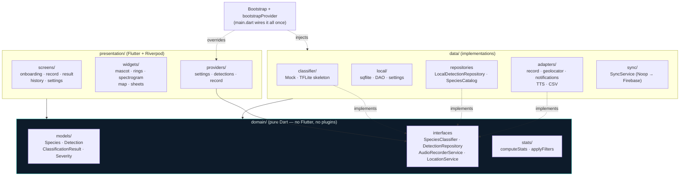
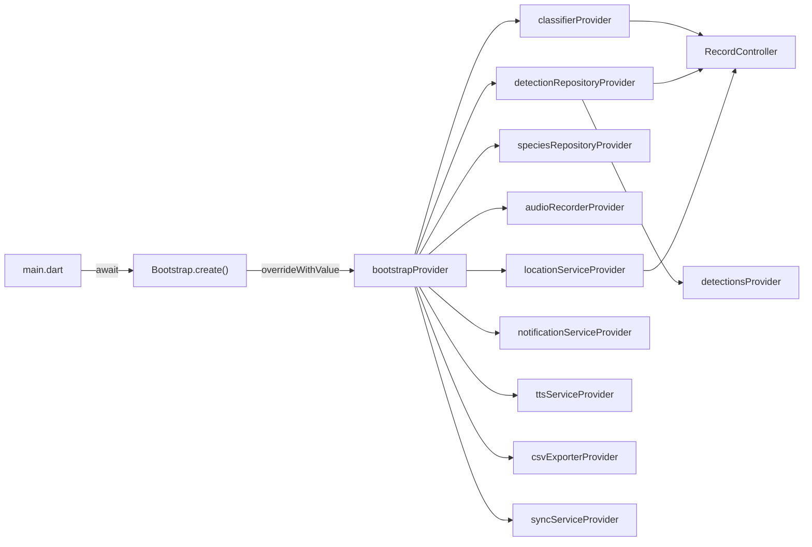
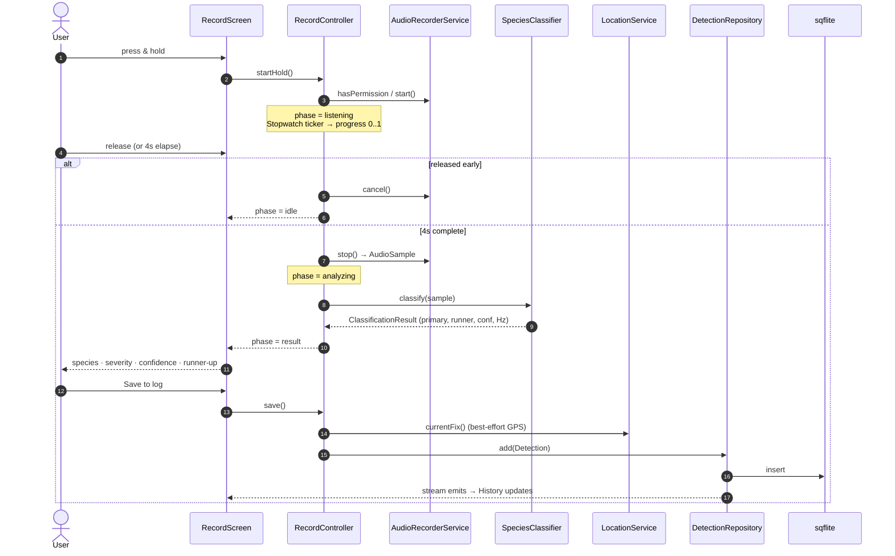
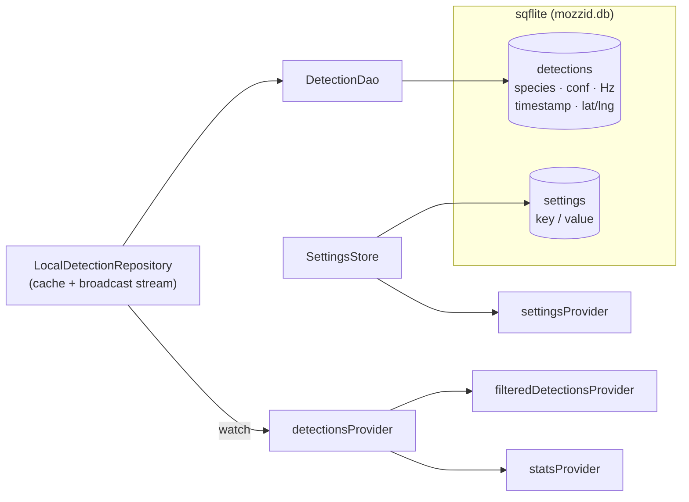

# MozzID — Architecture

Offline-first Flutter app that identifies mosquito species from their wingbeat,
on-device. This document explains the big-picture structure: the layering, the
two deliberate seams (ML + backend), how a detection flows from mic to log, and
where state and persistence live.

---

## 1. Layered architecture

Clean architecture with a strict **inward** dependency rule. `domain/` is pure
Dart and depends on nothing else; `data/` and `presentation/` both depend on
`domain/`, never on each other's concretions.



**The rule in practice:** to add a capability (a sensor, an export format, a
backend), declare an interface in `domain/`, implement it in `data/`, and wire
it in `Bootstrap`. Widgets and domain logic never import a plugin directly.

---

## 2. Dependency injection

Everything is assembled once in `Bootstrap.create()` and injected through a
**single** `bootstrapProvider` override in `main.dart`. Every other
infrastructure provider derives from it, so swapping an implementation (Mock →
TFLite classifier, Noop → Firebase sync) is a one-line change in one file.



Riverpod is used **without codegen** — plain `Notifier` / `Provider`. In tests,
override `bootstrapProvider` with fakes to drive the whole graph.

---

## 3. The two seams

### ML seam — `SpeciesClassifier`

The single boundary between the app and the wingbeat model. The whole
record→analyze→result→save flow depends on this interface, never a concrete
model.

| File | Role |
|------|------|
| `domain/classifier/species_classifier.dart` | the interface + `AudioSample` input |
| `data/classifier/mock_species_classifier.dart` | **live today** — plausible fake result |
| `data/classifier/tflite_species_classifier.dart` | skeleton with drop-in steps |

Landing the real model: implement `TfliteSpeciesClassifier` (decode WAV →
mel-spectrogram → CNN → softmax → top-2 → map to `Species`), then swap one line
in `Bootstrap.create()`. No UI or domain changes.

### Backend seam — `SyncService`

The app is fully functional offline; sync is additive. Bound to
`NoopSyncService` by default so **nothing** depends on Firebase. Implement
`FirebaseSyncService` against the interface and override the provider to enable
cross-device sync, aggregate maps, and model updates.

---

## 4. Capture data flow

The core interaction — press-and-hold to identify a mosquito and save it —
routed entirely through interfaces and the offline database.



Key properties:
- **Progress** is a `Stopwatch` + 16 ms ticker; releasing before 4 s cancels the recording and returns to idle.
- **GPS is best-effort** — a denied/failed fix still saves the detection (offline-first).
- **History is reactive** — `LocalDetectionRepository` emits on a broadcast stream, so the list/map/stats refresh the instant a detection is saved.

---

## 5. State & persistence

- **`RecordController`** (`Notifier<RecordState>`) — the capture state machine: `idle → listening → analyzing → result`. Owns recorder/classifier/location/repo interactions and the save path.
- **`settingsProvider`** — language, theme, accent, voice, background, onboarding. Live: theme/accent/locale changes rebuild `MaterialApp`. Persisted to a key/value table.
- **`detectionsProvider`** (stream) → **`filteredDetectionsProvider`** (species + date filter) and **`statsProvider`** (`computeStats` over the full log).
- **Storage** — one `sqflite` database: `detections` (the offline source of truth, with real timestamps + GPS) and `settings` (key/value). `AppDatabase.seedDemoData` seeds demo rows on first install.



---

## 6. Theming as design tokens

The full palette is a `MozzColors` `ThemeExtension` derived from
`(Brightness, AppAccent)`. Widgets read colour via `context.c`, fonts via
`MozzType`, strings via `context.l`. Switching theme or accent in Settings
rebuilds the theme and recolours the app live — so UI must always pull from
those accessors, never hardcode a colour, font, or string.

Severity is **colourblind-safe by contract**: every level pairs a glyph shape
(▲ / ● / ■) with a text label; colour only reinforces, never carries meaning
alone.

---

## 7. Module map

```
lib/
├── core/theme/          MozzColors, AppAccent, typography, dimens
├── core/l10n_ext.dart   context.l accessor
├── domain/
│   ├── models/          Species, Detection, ClassificationResult, Severity
│   ├── classifier/      SpeciesClassifier interface  ← ML SEAM
│   ├── repositories/    DetectionRepository, SpeciesRepository
│   ├── services/        AudioRecorderService, LocationService
│   └── stats/           computeStats, applyFilters  ← unit-tested
├── data/
│   ├── classifier/      MockSpeciesClassifier, TfliteSpeciesClassifier
│   ├── local/           AppDatabase, DetectionDao, SettingsStore
│   ├── detection/       LocalDetectionRepository
│   ├── species/         SpeciesCatalog
│   ├── audio/ location/ notifications/ voice/ export/   adapters
│   └── sync/            SyncService  ← BACKEND SEAM
├── presentation/
│   ├── providers/       bootstrap, settings, detections, record_controller
│   ├── screens/         onboarding, home_shell, record, result, history, settings
│   └── widgets/         mascot, rings, spectrogram, map, sheets
├── l10n/                app_en.arb, app_id.arb
├── app.dart             MaterialApp: live theme + locale, onboarding gate
└── main.dart            Bootstrap + single provider override
```
